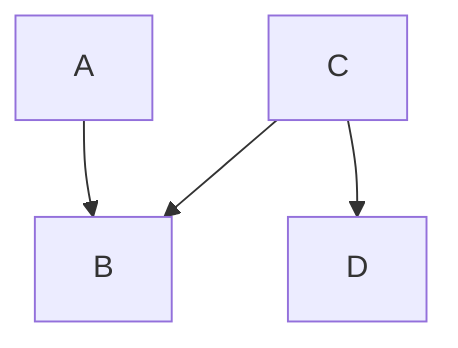
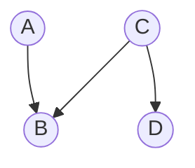

# Aprendizado de maquina

Prof. Anderson Ara

## Bayes

Teorema de Bayes:

$$
P (A|B) = \frac{P(A \bigcap B)}{P(B)} = \frac{P(A|B)P(B)}{\sum_j P(B|A_j)P(A_j)}
$$

## Redes Bayesianas

Ver material do Prof. :
http://leg.ufpr.br/~ara/teach/rb

Produto Bayesiano:

$$
P(X_i|X_j,pa(X_i)) = P(X_i|pa(X_i))
$$

$$
P(X_1, X_2, ..., X_p) = \prod_{i=1}^{p} P(X_i|pa(X_j))
$$

Graficos
* vertices (nodes)
* arcos (edges or arcs)

### Exemplo

SE:

* $A \bot B \mid C$ (arrumar)

ENTAO: 

* $P(A,B,C,D) = P(B|A,C)P(D|C)P(A)P(C)$

#### Vértices
A rede Bayesiana é composta pelos seguintes nós (variáveis aleatórias):

- **A**: Variável aleatória que não depende de nenhum outro nó.
- **B**: Depende condicionalmente de A e C.
- **C**: Não depende de nenhum outro nó (é uma variável independente).
- **D**: Depende condicionalmente de C.

#### Arcos
As dependências condicionais entre os nós são representadas por setas (arcos direcionados), que indicam a relação causal ou probabilística entre as variáveis. A estrutura do gráfico é a seguinte:

- **A → B**: O nó A influencia diretamente o nó B.
- **C → B**: O nó C influencia diretamente o nó B.
- **C → D**: O nó C influencia diretamente o nó D.

#### Explicação dos Arcos:
- **P(B|A,C)**: A variável B é influenciada tanto por A quanto por C, resultando nas duas setas que apontam para B.
- **P(D|C)**: A variável D é influenciada apenas por C, resultando em uma seta que vai de C para D.
- **P(A)** e **P(C)**: As variáveis A e C são independentes, portanto, não possuem arcos de entrada (setas apontando para elas).

### Visualização

A estrutura pode ser visualizada como um grafo dirigido acíclico (DAG), da seguinte forma:

VER
https://www.bnlearn.com/

### Bibliografia

- Bayesian Networks: An Introduction (Wiley Series in Probability and Statistics) by Koski, Timo, Noble, John published by Wiley-Blackwell (2009)

